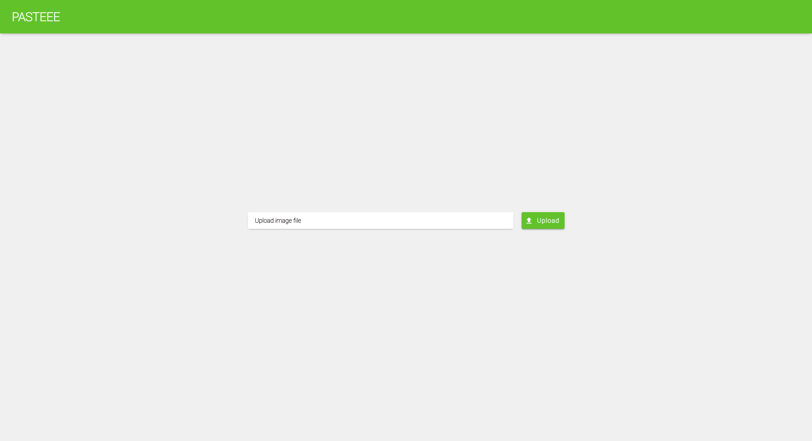
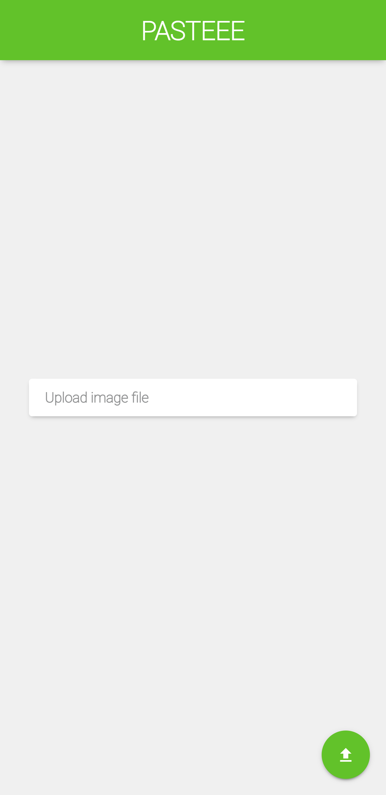
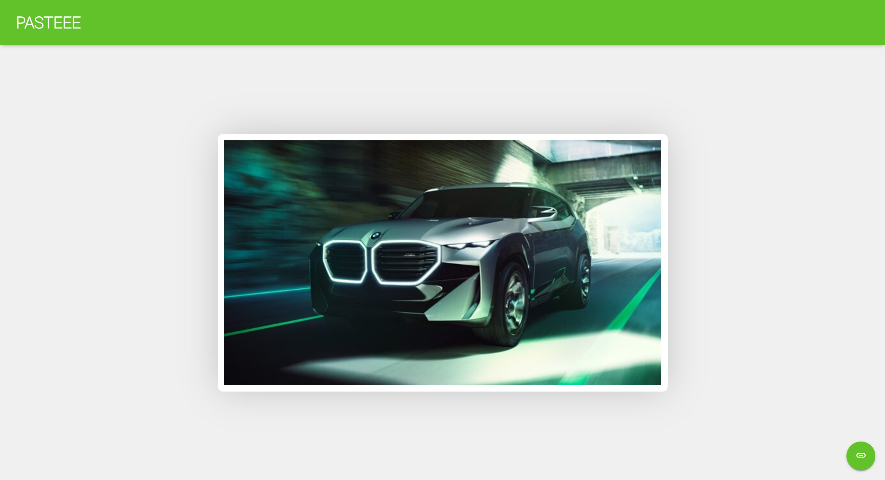
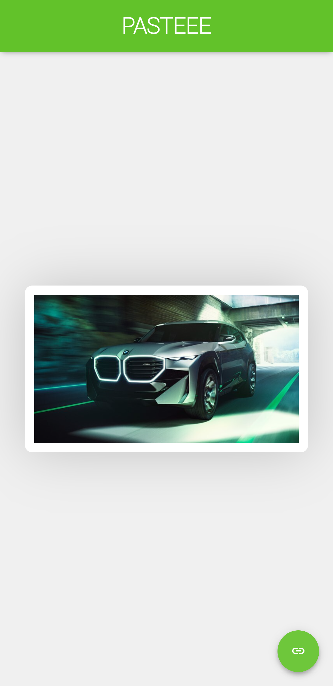
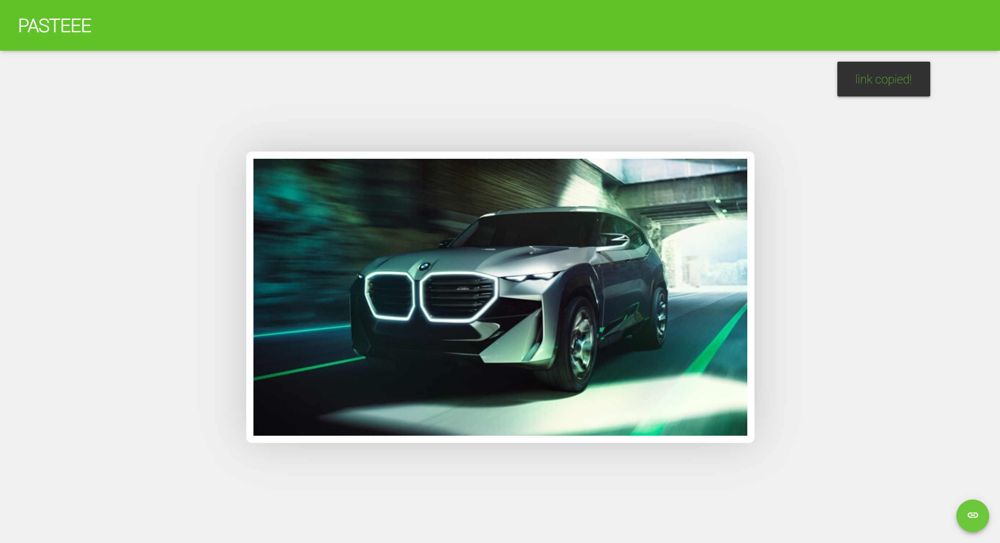
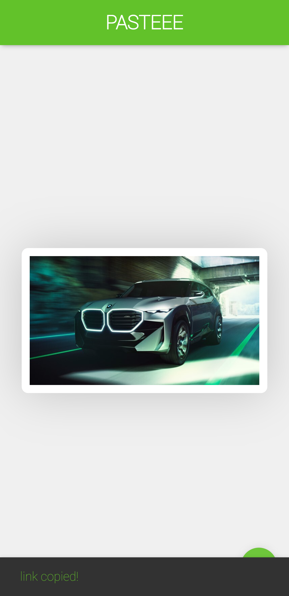
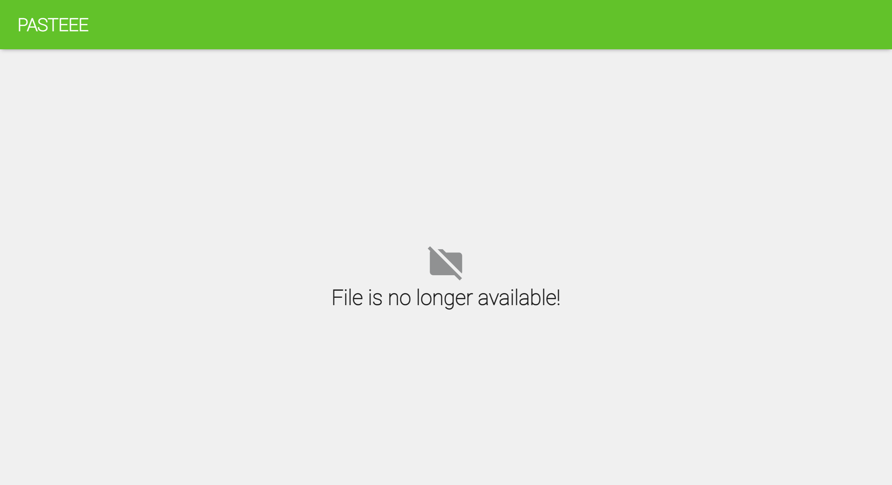
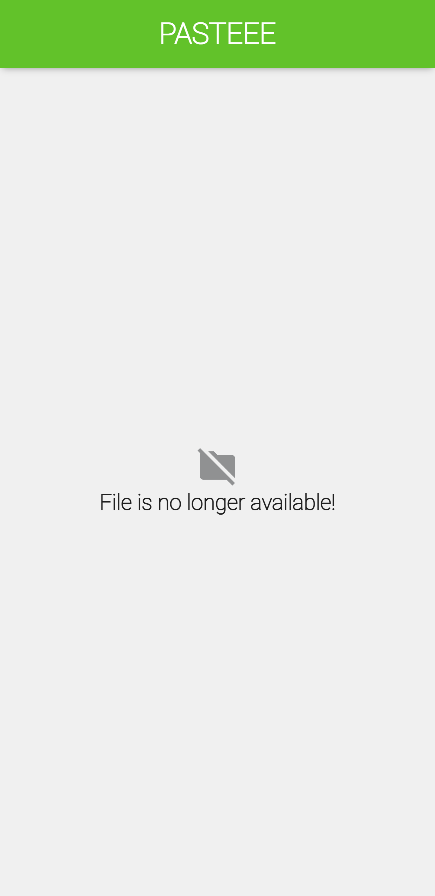

  <h1>Pasteee</h1>

**🔥 Description**  

A simple image clipboard made using python's  
django framework.

**REQUIREMENTS** 
- django
- cryptography
  
\>> <code>py -m pip install -r ./requirements.txt</code>  

**RUNSERVER** 
\>> <code>py manage.py makemigrations</code>  
\>> <code>py manage.py migrate</code>         
or                                            
\>> <code>py manage.py migrate --run-syncdb</code>  

# 📷 SAMPLE SCREENSHOTS

  
  
  
  
  
  
  
  

